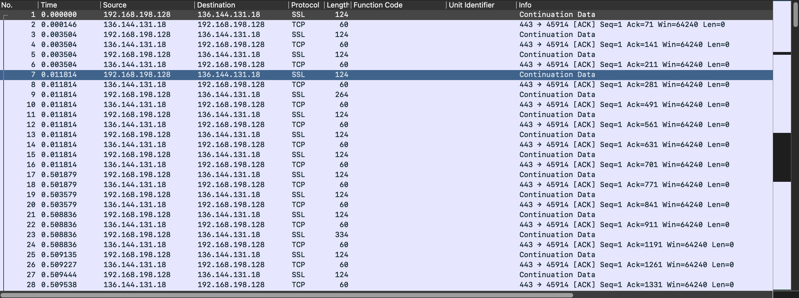

# Unlock The City 2022 - Phase 1 - Technical Debt
*This challenge was developed by DHaines@DeloitteNL*

## Challenge information

> Some of the systems in our factory still stem from around 1984, and we noticed the AI was even infecting these systems. We have captured suspicious network traffic between these systems, however have not been able to identify what data was being transfered. Can you identify what data was going over the lines?

## Flag information

> Can you find out what the AI was sending between these archaic systems?

## Files

- [technical-debt.pcapng](../static/technical-debt.pcapng)

---

## Solution

After reading the challenge description, the first step is to download the **pcapng** file and open it with 
Wireshark. If you are not familiar with the *.pcapng file extension* you can learn about it [here](https://filext.com/file-extension/PCAPNG).

Once you open Wireshark you should see something like this:



Following the information presented in the challenge description, we should be looking for uncommon
protocols used. The year *1984* gives us the hit that we should search for **Apple communication protocols**, knowing that 1984 is the year the Macintosh computer launched. If we scroll down the packet stream, we find three black highlighted 
packages by Wireshark.


Looking at the *Protocol* column in Wireshark, we observe two different protocols: **AFP** and **ATP**.
- *AFP: AppleTalk Filing Protocol* [AFP-documentation](https://developer.apple.com/library/archive/documentation/mac/pdf/Networking/AFP.pdf)
- *ATP: AppleTalk Transaction Protocol* [ATP-documentation](https://developer.apple.com/library/archive/documentation/mac/pdf/Networking/ATP.pdf)

Before the contest, I have never encountered any Apple protocol at all. So in order to proceed, I had to do some research on how AFP and ATP are working and more importantly how can I exploit them. Looking at the Apple Developer Documentation we get this definition for *ATP*:

> The AppleTalk Transaction Protocol offers a simple, efficient means of transferring small amounts of data across a network; it lets one network entity request information of another entity that possesses only the ability to respond to the request. ATP ensures that data is delivered without error or packet loss. ATP communication is based on the concept of a transaction: one party, the requester, makes a request of another party, the responder, to perform a service and return a response.

Doing the same for *AFP*:

> AFP is a remote filing system protocol that provides a workstation on an AppleTalk network with access to a server that is implemented according to the AFP file system structure. AFP also includes user authentication support and an access control mechanism that supports volume-level and folder-level access rights.

In a nutshell it seems that the AFP protcol facilitates the communication to a file server. Going back to Wireshark, we can see that the previous highlighted packets represent a request-reply conversation, asking about parameters for a particular volume (according to the definition of *FPGetVolParms*). Good! Now we have some clue about what we should be looking for.

---

Inspecting the rest of the .pcapng file, it's pretty clear there is one more conversation using ATP and AFP.


The first thing that meets the eye by looking at the *Info* column is **'Name=image1'**. More specifically, there is a 
request for the parameters of a file named 'image1'. Taking a closer look at the reply, we find some interesting information.    


---

There is a Data fork of 7527 bytes and a Resource fork of 501 bytes. While the data fork utility is pretty obvious as it should contain the actual bytes that make the file 'image1', the resource fork does not come so easily. Doing a quick search on Wikipedia and we find:

> A resource fork stores information in a specific form, containing details such as icon bitmaps, the shapes of windows, definitions of menus and their contents, and application code (machine code). For example, a word processing file might store its text in the data fork, while storing any embedded images in the same file's resource fork. The resource fork is used mostly by executables, but every file is able to have a resource fork.

Following the rest of the conversation, there is a request to open two forks: 86 and 87. Taking a closer look using Wireshark, we can see that fork 86 corresponds to the Data fork while fork 87 is assigned to the Resource fork.  

**fpGetForkParms - retrieves parameters for a file associated with a particular fork.** (AFP documentation). 

---

**fpRead - Reads a block of data from an open fork** (AFP documentation)

Packet number 175 signifies the start of reading the bytes from fork 86 (Data fork), which is sent in a bunch of fragments and reassembled at packet number 183. A similar process goes for the Resource fork, which is sent in one piece as it's only 501 bytes.

The AFP protocol does not encrypt the data it transfers, which is good news for us as we can intercept it.


Lets copy the byte stream from the Resource fork and convert it in some readable form. Quickest way to do this is using *Show Packet Bytes...* functionality in Wireshark.


A new acronym (**PNTGMPNT**). Doing a quick search, *PNTGMPNT* is related to **MacPaint image data**. Putting information head to head, the file *image1* from the file server is a MacPaint image. Now it's time to use the other fork opened, which is supposed to contain the actual image. 

---

Let's copy the hex stream from the **fpRead** response. Keep in mind that the data is divided into 2 parts. At last, we can write a simple Python script to write the binary data to a file to reconstruct the original file 'image1'.

```python

# script.py file

hexstream = # 7527 bytes of hexstream copied from Wireshark
b = bytes.fromhex(hexstream)

with open('image1', mode='wb') as f:
    f.write(b)
    f.close()


# execute the script using: python script.py in terminal
```

Unfortunately, its not that straightforward to open a MacPaint image file as standard software doesn't seem to work (archaic software:) ). However, I found that GraphicConverter should do the trick. 

[Graphic-Converter](https://www.lemkesoft.de/en/products/graphicconverter/)


Seems like we found the flag!

**CTF{AppleTalksAppleTalk}**

